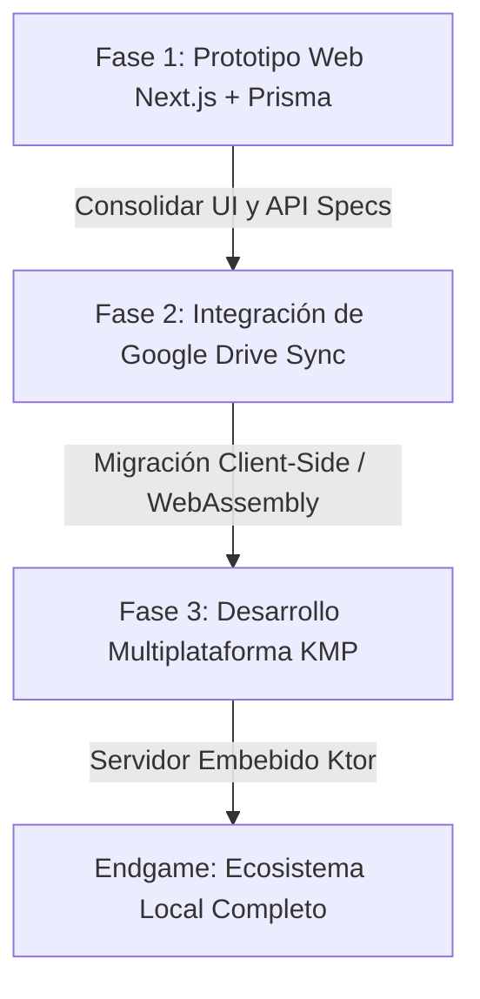
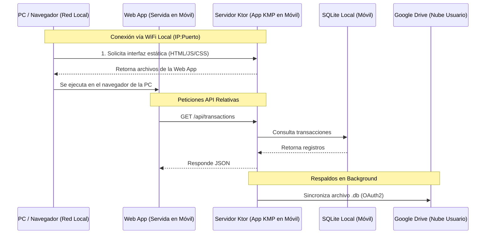

# Arquitectura del Proyecto: Money Manager (Endgame & Roadmap)

Este documento describe la visión a largo plazo, la arquitectura del sistema y el roadmap para la evolución de **Money Manager** desde su prototipo web actual hasta una solución multiplataforma Local-First con almacenamiento en la nube del usuario y servidor embebido.

---

## 1. Visión General: Privacidad y Control Total
El principio fundamental de **Money Manager** es otorgar al usuario el control absoluto sobre sus datos financieros. La aplicación no dependerá de un servidor o base de datos central de terceros. En su lugar:
*   **Almacenamiento Local-First:** El dispositivo del usuario es el dueño físico de la base de datos (SQLite).
*   **Sincronización en la Nube del Usuario:** El respaldo y sincronización se realizan directamente en el **Google Drive** personal del usuario (usando un espacio oculto y seguro de la aplicación).
*   **Servidor Embebido (El teléfono como Host):** La aplicación móvil puede actuar como un servidor de red local para permitir el acceso desde computadoras u otros dispositivos en la misma red WiFi sin requerir internet ni hosting externo.

---

## 2. Roadmap de Desarrollo

### Fase 1: Prototipo Web (Estado Actual)
Desarrollo ágil de la interfaz y la lógica financiera en una aplicación web.
*   **Tecnologías:** Next.js (App Router), Tailwind CSS (Mobile First), Prisma, SQLite.
*   **Propósito:** Definir de forma precisa todos los componentes visuales (Cuentas, Categorías, Subcategorías, Transacciones, Auditorías), validar reglas de negocio, y establecer la **especificación de la API REST** que servirá de contrato para el backend móvil.

### Fase 2: Almacenamiento y Sincronización con Google Drive
Independizar el almacenamiento hacia el lado del usuario mediante integraciones OAuth.
*   **Google OAuth2 & Drive API:** Autenticación en cliente para interactuar con la carpeta `appDataFolder` de Drive.
*   **Mecanismo de Respaldo:** El archivo SQLite local se sube/descarga de forma periódica con base en timestamps de última modificación.

### Fase 3: Multiplataforma con Kotlin Multiplatform (KMP)
Crear la aplicación móvil nativa para iOS y Android compartiendo la lógica central.
*   **Base de Datos Móvil:** SQLDelight o Room KMP para persistir los datos de forma nativa en SQLite.
*   **Kotlin Multiplatform:** Compartir la lógica de transacciones, importación y conciliación entre Android e iOS.

### Fase 4: Servidor Local Móvil (Ktor Server)
Convertir el móvil en el servidor central de la red doméstica.
*   **Servidor Embebido (Ktor):** Levantar un servidor HTTP ligero en el teléfono móvil que escuche en un puerto local (ej. `8080`).
*   **Servicio de Assets:** Servir los archivos estáticos de la Web App Next.js exportados mediante `next export`.
*   **Servicio de API:** Ktor expone los mismos endpoints `/api/*` que definimos en Next.js, leyendo/escribiendo en la BD SQLite local del teléfono.

---

## 3. Diagrama de la Arquitectura Endgame (Fase 4)

---

## 4. Especificación de Endpoints (Contrato de API)
Para que el servidor **Ktor** móvil pueda reemplazar transparentemente al backend de Next.js, debe emular exactamente los siguientes endpoints definidos en el prototipo web:

### Cuentas (`/api/accounts`)
*   `GET /api/accounts`: Listar cuentas y saldos.
*   `POST /api/accounts`: Crear una nueva cuenta.
*   `PUT /api/accounts/[id]`: Actualizar cuenta.
*   `DELETE /api/accounts/[id]`: Eliminar cuenta.

### Categorías y Subcategorías (`/api/categories` y `/api/subcategories`)
*   `GET/POST/PUT/DELETE` para gestionar la taxonomía de clasificación de gastos/ingresos.

### Transacciones (`/api/transactions`)
*   `GET /api/transactions`: Obtener transacciones filtradas por tipo, rango de fechas y paginación.
*   `POST /api/transactions`: Registrar una nueva transacción (Ingreso, Gasto o Transferencia).
*   `PUT/DELETE /api/transactions/[id]`: Modificar o eliminar transacciones (recalculando balances).

### Importación (`/api/import`)
*   `POST /api/import/analyze`: Parsear y mapear un archivo CSV local para proponer inserciones.
*   `POST /api/import/commit`: Persistir de forma masiva los registros importados y registrar un único log de auditoría.

### Auditoría (`/api/audit`)
*   `GET /api/audit`: Consultar la línea de tiempo de cambios (`AuditLog`) con soporte de paginación y filtros por tipo de entidad y acción (CREATE, UPDATE, DELETE, IMPORT).

---

## 5. Próximos Pasos en el Prototipo Web
1.  **Asegurar desacoplamiento absoluto:** No introducir lógica de base de datos directa en los componentes de React; todo el consumo de datos debe ser por `fetch` a rutas relativas de la API.
2.  **Mantener la base de datos sincronizada en desarrollo:** Usar la base de datos SQLite para simular escenarios reales de migración y volumetría de datos.
3.  **Exportación estática:** Validar periódicamente que el proyecto de Next.js compila de forma estática sin errores ejecutando `next build` con la configuración `output: 'export'` activada de manera simulada.
